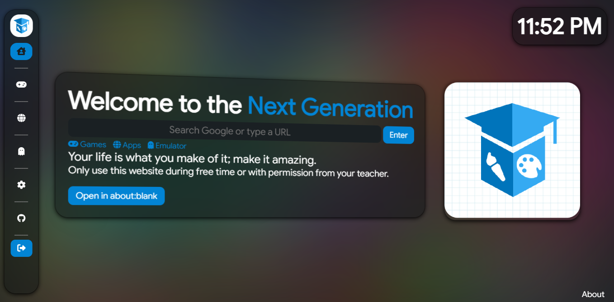
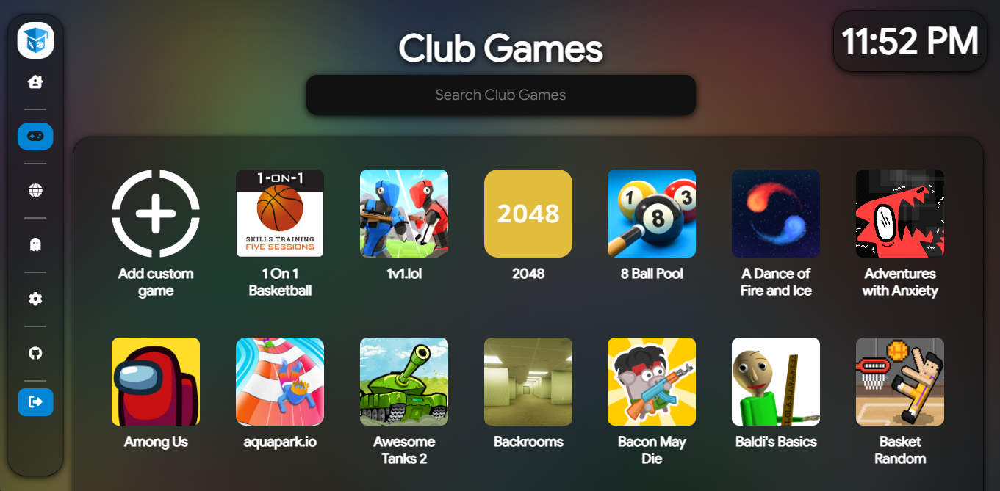
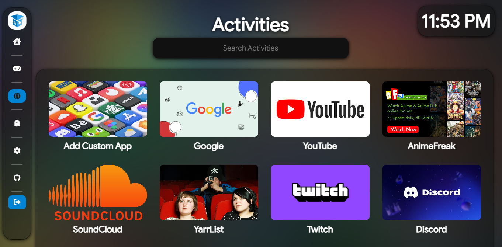
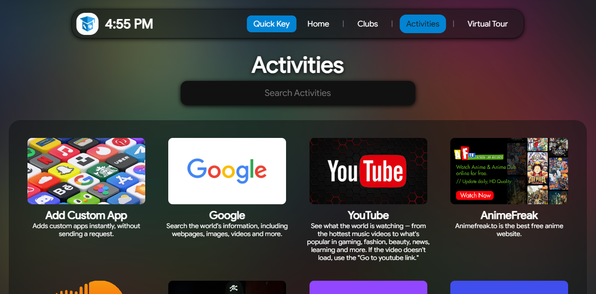
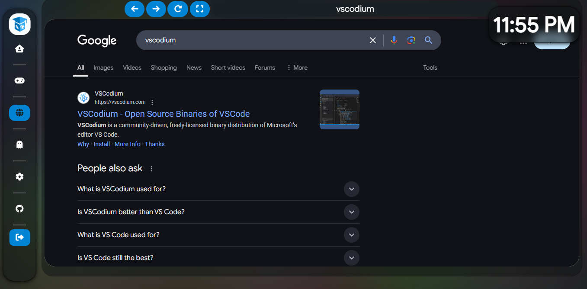
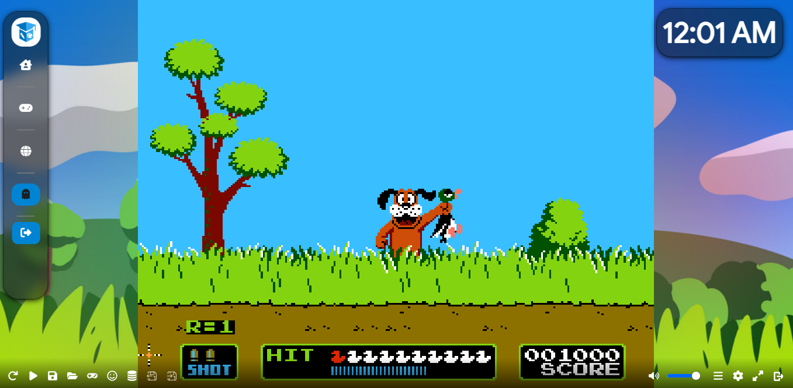

  

## Art Class Enhanced

🖌️🎓🎨 Regular Art Class but enhanced, including an integrated emulator, more games, improved app list, and a browser The website is best viewed at a Chromebook's native resolution (below 1080p). 🖌️🎓🎨

## Screenshots
<div align="center" style="display: flex;
    align-items: center;
    justify-content: center;">



</div>
<div align="center" style="display: flex;
    align-items: center;
    justify-content: center;">



</div>

## Embedding an about:blank Button to Your Google Site?
Remember to add /gsites.html to your link.

## Deploy to a cloud service
[](https://railway.app/new/template?template=https://github.com/havi11/artclass-enhanced)
[](https://app.koyeb.com/deploy?type=git&repository=github.com/havi11/artclass-enhanced&branch=main&name=v4)
[](https://render.com/deploy?repo=https://github.com/havi11/artclass-enhanced)
[](https://vercel.com/new/clone?repository-url=https://github.com/havi11/artclass-enhanced)

> You currently cannot deploy Art Class to a static host, such as Netlify, Cloudflare Pages, or GitHub Pages. This feature is planned in a future update. Vercel does work - however, don't expect verification to work.

## Adding Retro Games
Use the example provided in public/assets/data/retros.js

## Hosting Your Retro Games Server
It's best to create a seperate directory and locally host your games server there (Instructions Below) and port foward it to your IP Address. Also use FreeDNS to hide your IP Address. It's best to use port 80 for Let's Encrypt verification.

## Run locally

You need [NodeJS](https://nodejs.org) and [Git](https://git-scm.com/download) installed on your system.

````bash
git clone https://github.com/havi11/artclass-enhanced.git # Clone the repo
npm install # Install packages
npm start # Start the bare server + serve static files
````

## Support
Most issues can be answered by [opening an issue](https://github.com/havi11/artclass-enhanced/issues).

You can also join their [Discord server](https://discord.gg/desmos) for more support, or to get links.

## Contributors

[](https://github.com/art-class/v4/graphs/contributors)
